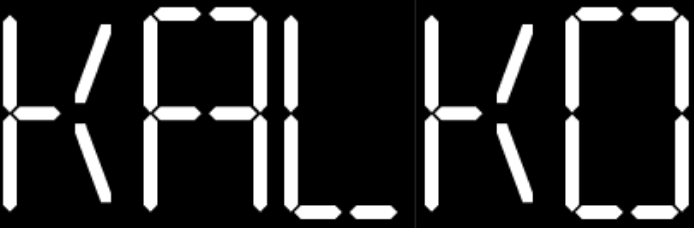
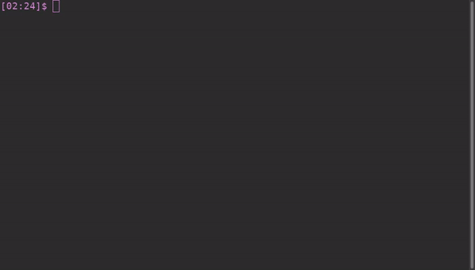

<div align="center">



</div>

<br />

# Kalko: (Kal)kulator+(ko)nversi

Kalko is a command-line based calculator with unit conversion feature. Kalko is short for "KALkulator" and "KOnversi" which means calculator + conversion. The conversion feature is a unit conversion such as *kilogram*(kg) to *gram*(g), *mile* to *kilometer*(km), etc.

> **Note**: This project is only a playground for me to learn Rust programming language so there might be unstable feature. You're welcome to experiment

## Features

- [x] Basic math operation
  
  - add (`+`)
  
  - substract (`-`)
  
  - multiply (`x`)
  
  - divide (`/`)

- [x] Unit conversion
  
  - distance (meter, mile, feet)
  
  - weight (pound, gram, ounce)

- [ ] Interactive shell mode [Planning :memo:]

## How to use

* Container
  
  ```shell
  # Dcker
  docker run -it --rm --name kalko ky64/kalko:0.1
  
  # Podman
  podman run -it --rm --name kalko ky64/kalko:0.1
  ```
  
  Then start type `kalko` to use it.

* Manual
  
  ```sh
  git clone https://
  cd kalko
  cargo build --release
  sudo ln -s $(pwd)/target/release/kalko /usr/local/bin/kalko
  ```

## Usage

**Calculator**

```shell
kalko [number][+ / x -][number]
```


**Conversion**

```shell
kalko [source unit] [target unit]
```



### Inspiration

* [bc](https://www.gnu.org/software/bc/)

* [alfredxing/calc](https://github.com/alfredxing/calc)

* [NerdyPepper/eva](https://github.com/NerdyPepper/eva)

* [Frink](https://frinklang.org/#HowFrinkIsDifferent)

* [Plasma/Krunner](https://userbase.kde.org/Plasma/Krunner#Calculator)

### Attribute

* [7 Segmental Digital Display Font | dafont.com](https://www.dafont.com/7-segmental-digital-display.font?psize=l&text=KALKO)
